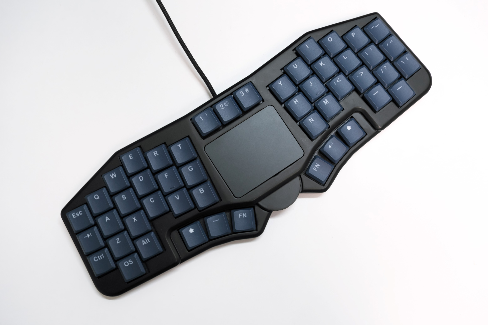

# Futaba

Futaba is a keyboard with trackpad.

## Features

- One-step-down thumb cluster that reduces fatigue even after long hours of work.
- Trackpad with multi-touch support for up to four fingers.
- Clickable giant wheel.
- Stack-mounted and flex-cut for the same feel on every key.
- Cable guides for easy use in tight spaces.

## Directory structure

This repository contains hardware design data only.

- Cases
    - 3D data of cases designed with FreeCAD.
    - It also contains stl files.
- Forms
    - Cut data of forms designed in Affinity Designer that can be ordered from Yousha Kobo.
- PCB
    - PCB data designed by KiCAD.

## About Firmware

QMK firmware or Vial firmware can be obtained from the following URL

- QMK Firmware
  - https://github.com/geek-rabb1t/qmk_firmware/tree/futaba
- Vial
  - https://github.com/geek-rabb1t/vial-qmk/tree/futaba

## Build Guide

Please read here.

- https://geek-rabb1t.github.io/futaba/build_guide

---

# Futaba

Futabaはトラックパッド付きキーボードです。

## 特徴

- 長時間の作業でも疲れにくい、一段下がった親指クラスタ。
- 4本指までのマルチタッチに対応したトラックパッド。
- クリック可能な巨大ホイール。
- スタックマウントとフレックスカットにより、どのキーも同じ打鍵感。
- 狭い場所でも使いやすいケーブルガイド。

## ディレクトリ構造

このリポジトリにはハードウェアの設計データのみ格納しています。

- case
    - FreeCADで設計したケースの3Dデータ。
    - stlファイルも含まれます。
- form
    - Affinity designerで設計した遊舎工房に発注可能なFormのカットデータ。
- pcb
    - KiCADで設計したPCBデータ。

## ファームウェアについて

以下のURLにQMK Firmwareもしくは、 Vialのファームウェアがあります。

- QMK Firmware
  - https://github.com/geek-rabb1t/qmk_firmware/tree/futaba
- Vial
  - https://github.com/geek-rabb1t/vial-qmk/tree/futaba

## 組み立て手順

こちらをご覧ください。

- https://geek-rabb1t.github.io/futaba/build_guide